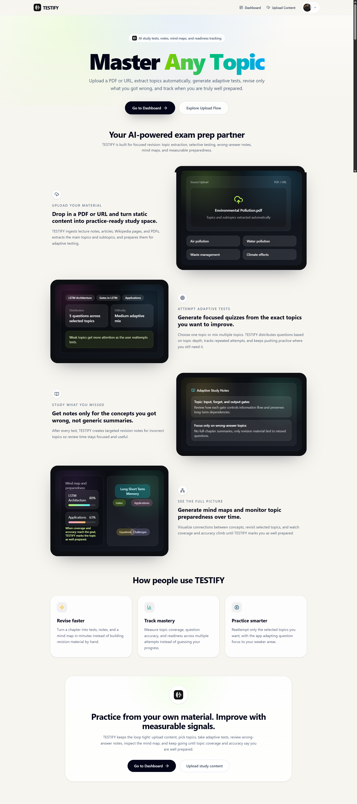
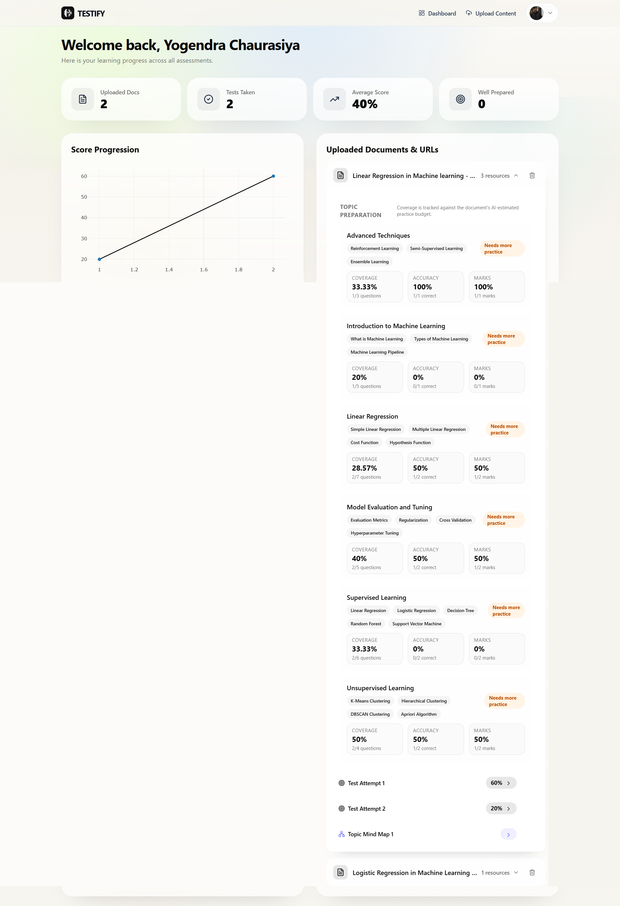
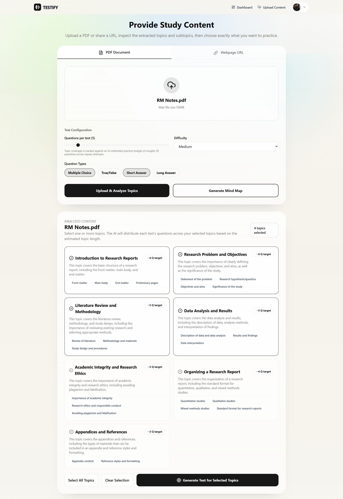
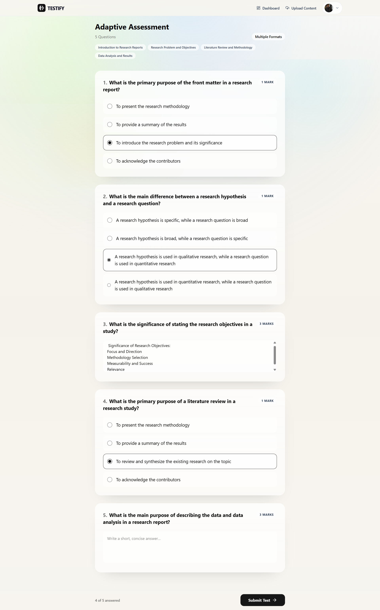
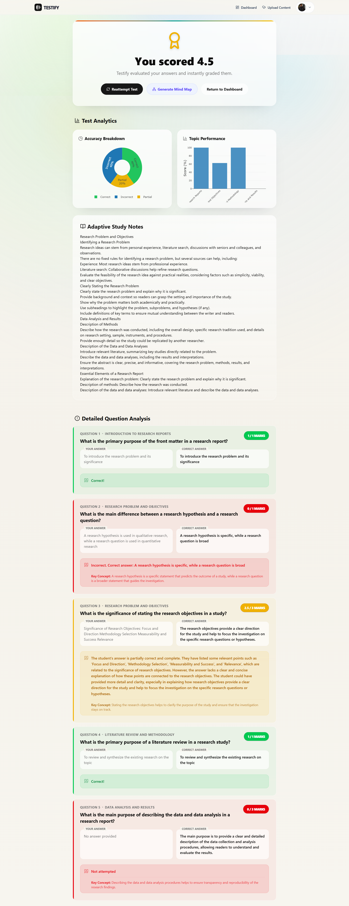
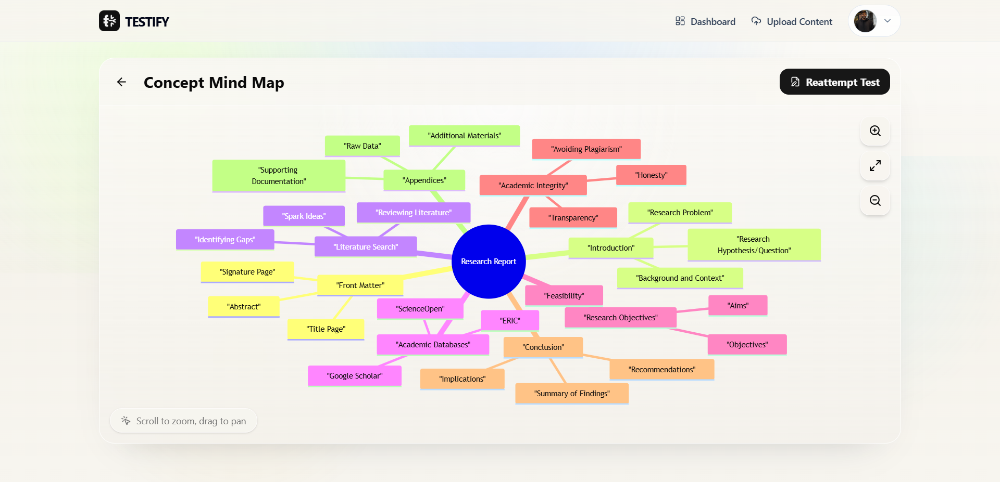

# TESTIFY - Full-Stack AI Learning Platform

[](https://testifyproject.vercel.app)

TESTIFY is an intelligent, full-stack AI-driven educational platform designed to turn your static study materials (PDFs and webpages) into personalized, interactive assessments and visual mind maps. It tracks your learning progress, understands topic-specific preparation levels, and adapts to your knowledge gaps using advanced Retrieval-Augmented Generation (RAG).

**Live Website Endpoint:** [https://testifyproject.vercel.app](https://testifyproject.vercel.app)

---

## 📸 Screenshots

Here is a glimpse of the TESTIFY platform in action:

<table align="center">
  <tr>
    <td></td>
    <td></td>
  </tr>
  <tr>
    <td></td>
    <td></td>
  </tr>
  <tr>
    <td></td>
    <td></td>
  </tr>
</table>

---

## ✨ Features and Benefits

### Core Features
- **Upload & Ingest content:** Easily upload PDF documents or provide article/webpage URLs to act as your study material base.
- **Smart Topic Extraction:** The AI automatically scans your uploaded materials and breaks them down into structured topic outlines and subtopics.
- **Customizable Tests:** Generate targeted tests by selecting specific topics, adjusting the number of questions, setting the difficulty (Easy, Medium, Hard), and choosing question formats (Multiple Choice, True/False, Short Answer, Long Answer).
- **Interactive Mind Maps:** Convert textual study material into visual diagrams/mind maps for rapid review and spatial understanding.
- **Advanced Dashboard & Analytics:** Track your test scores dynamically with Plotly line graphs. The platform keeps track of which topics you are well-prepared for, measures your accuracy, and logs all your tests and uploaded documents.
- **Complete History Management:** View, manage, or delete past test attempts and uploaded materials effortlessly.

### User Benefits
- **Targeted Learning:** Instead of rereading lengthy texts, users can actively test their knowledge on specific subsections.
- **Visualization:** Generate mind maps of complex texts to quickly grasp the overarching structure.
- **Progress Visibility:** See quantifiable growth via the analytics dashboard and understand exactly which topics require more revision.
- **Privacy & Security:** Secure, cloud-based Google Authentication ensures users' study data remains private.

---

## 🛠️ Tech Stack & Architecture

TESTIFY is separated into a cohesive **Frontend** and **Backend**, connected via RESTful API endpoints.

### Frontend
- **Framework:** React + Vite + TypeScript (Lightning-fast rendering and build times)
- **Styling:** Tailwind CSS (Modern, premium dynamic UI with glassmorphism and smooth animations)
- **State Management & Fetching:** TanStack React Query (For declarative API data fetching and caching)
- **Authentication:** Firebase Auth (Google Sign-In integration)
- **Icons & Charts:** Lucide-React & React-Plotly.js
- **Hosting:** Vercel

### Backend
- **Framework:** FastAPI / Python (High performance asynchronous Python backend framework)
- **AI & LLM Integration:** LangChain framework querying Groq LLM for blazing-fast inference and context generation.
- **Embeddings & Vector Store:** HuggingFace `sentence-transformers` coupled with Qdrant vector database to store and retrieve document chunks.
- **Database:** Firebase Admin (Firestore) for persisting users, documents, tests, attempts, and analytics metadata.
- **Document Parsers:** PyPDF (for PDF extraction) and BeautifulSoup4 (for web scraping URLs).
- **Hosting:** Azure App Services

---

## 🧠 How It Works (The RAG Pipeline)

1. **Ingestion & Parsing:** When a user uploads a PDF or provides a URL, the FastAPI backend downloads and scrapes the textual content, breaking it down into appropriately sized text chunks.
2. **Embedding:** These chunks are converted into numerical vectors (Embeddings) via HuggingFace models and stored inside the Qdrant DB.
3. **Topic Modeling:** The system queries the LLM to analyze the entire document and extract a structured "Topic Outline".
4. **Test & Mindmap Generation:** When a user requests a test or mind map for certain topics, the backend uses **Retrieval-Augmented Generation (RAG)** to perform a semantic search against the Vector DB. The most relevant text chunks are pulled and fed as contextual prompt material to the Groq LLM, which meticulously authors the test questions or mind map structure out of the retrieved context.
5. **Evaluating Responses:** Test submissions are graded dynamically by the AI to ensure precision in tracking short/long/MCQ answers, storing the scored results directly into Firestore.
6. **Analytics Computation:** The backend dynamically calculates the moving average, accuracy spread, and preparation level status by joining document outlines with user attempts.

---

## 🚀 Running Locally

### Prerequisites
- Node.js & npm
- Python 3.9+
- Firebase service account and project keys
- Qdrant Vector DB instance (or local)
- Groq API Key

### 1. Backend Setup
```bash
cd testify-backend
python -m venv venv

# Windows
.\venv\Scripts\activate
# Mac/Linux
source venv/bin/activate

pip install -r requirements.txt

# Create a .env file based on environment variables
# Run the application
uvicorn main:app --reload --port 8000
```

### 2. Frontend Setup
```bash
cd testify-frontend
npm install

# Create a .env file with Vite and Firebase config variables
# Start the development server
npm run dev
```

Visit `http://localhost:5173` to explore TESTIFY locally!
